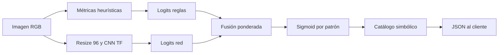

# Flujo del modelo de IA para patrones simbólicos (ceromancia asistida por visión)

Este documento describe cómo la aplicación pasa de una **foto de vela encendida** a una **interpretación simbólica**, y cómo se mapea cada patrón a una salida legible.

## 1. Entrada y preprocesado

1. El cliente envía `multipart/form-data` con la imagen (`POST /analizar`).
2. El servidor valida tipo MIME y tamaño (máx. 8 MB).
3. La imagen se decodifica a **RGB** y se normaliza a tensor flotante \([0,1]\).

## 2. Extracción de señales visuales (no aprendidas)

Sobre la matriz RGB se calculan métricas interpretables:

| Métrica | Idea aproximada |
|--------|------------------|
| `inclinacion_llama_grados` | Centroide de los píxeles más luminosos vs. eje vertical de la imagen; proxy de inclinación de la llama. |
| `asimetria_cera` | Diferencia de luminancia media entre mitades izquierda/derecha de la **mitad inferior** (cera derretida). |
| `ratio_residuos_oscuros` | Fracción de píxeles muy oscuros en la **franja superior** (hollín/humo). |
| `elongacion_gotas_inferior` | Relación de variación vertical vs. horizontal del gradiente en la zona baja (gotas/columnas). |
| `brillo_promedio_llama` | Media de luminancia en la máscara de “llama” (percentil alto de brillo). |

Estas métricas alimentan **reglas** (prior simbólico) y se concatenan al vector que entra en la red.

## 3. Rama neuronal (TensorFlow / Keras)

- La imagen se reescala a **96×96** y se aplana como entrada `imagen_flat`.
- Las cinco métricas forman el vector `heuristicas`.
- Arquitectura (`ceromancia_hibrida`):
  - `Reshape → Conv2D → MaxPool → Conv2D → GlobalAveragePooling2D → Dense(32)`.
  - Concatenación con `heuristicas`.
  - `Dense(48, relu) → Dense(num_patrones)` → **logits** (sin softmax; la combinación final usa sigmoid).

Los pesos convolucionales **no están entrenados con un dataset propio** en esta demo: aportan una señal suave; el comportamiento principalmente estable lo dan las **reglas**. En producción sustituirías esta etapa por un modelo entrenado (transfer learning desde MobileNet/EfficientNet + cabezal denso, o YOLO/segmentación si etiquetas finas).

## 4. Fusión neuro-simbólica

Para cada patrón \(k\) del catálogo:

1. Se calculan **logits heurísticos** \(L^{reg}_k\) a partir de umbrales y funciones suaves de las métricas (`prior_reglas`).
2. Se obtienen **logits de red** \(L^{nn}_k\).
3. Se combinan: \(L_k = \alpha L^{nn}_k + (1-\alpha) L^{reg}_k\) con \(\alpha \approx 0.35\) en código.
4. Probabilidad por patrón: \(\sigma(L_k)\) (sigmoid), tratando cada patrón como **etiqueta independiente** (multi-etiqueta).

Así se mantiene **trazabilidad**: las reglas explican gran parte de la decisión; la red puede aprender matices cuando exista datos.

## 5. Mapeo patrón → salida simbólica

El archivo `backend/analysis/patterns_catalog.py` define un diccionario `PATRONES`:

- **`id`**: clave estable usada en API y logs.
- **`nombre`**: etiqueta humana en español.
- **`interpretacion`**: texto simbólico predefinido (lo que ve el usuario).
- **`detalle_modelo`**: explicación técnica de qué señal dispara el patrón.

La API filtra coincidencias con confianza < 0.12, ordena por confianza y devuelve hasta seis entradas. El **mapeo** es directo: `pattern_id` → fila del catálogo → campos de presentación.

### Tabla de referencia rápida (`pattern_id` → JSON y significado)

Cada fila del catálogo se expone en `POST /analizar` como un objeto `PatternMatch` con los mismos campos lógicos.

| `pattern_id` | Campos en respuesta | Señales que lo favorecen (prior por reglas) |
|--------------|---------------------|-----------------------------------------------|
| `llama_inclinada` | `nombre`, `interpretacion`, `confianza`, `detalles_visuales` | `inclinacion_llama_grados` cercana a ±45° (proxy: centroide de píxeles muy brillantes desplazado del eje). |
| `cera_colgante` | idem | `elongacion_gotas_inferior` alta (gradiente más alargado en vertical en zona baja). |
| `residuos_hollin` | idem | `ratio_residuos_oscuros` alto en franja superior. |
| `llama_estable` | idem | Baja inclinación, baja asimetría y pocos residuos (combinación “equilibrada”). |
| `cera_asimetrica` | idem | `asimetria_cera` alta entre mitades izquierda/derecha de la mitad inferior. |
| `figura_organica` | idem | Patrón residual cuando ningún otro domina con fuerza (forma difusa). |

En código, `prior_reglas` en `tf_model.py` asigna logits heurísticos por índice fijo (`orden_patrones()`); la red añade logits aprendibles (en demo, pesos aleatorios fijados por semilla) y la fusión produce la `confianza` final por patrón.

## 6. Cómo mejorar el reconocimiento (roadmap técnico)

1. **Datos**: recopilar fotos etiquetadas (multi-etiqueta) por expertos en lectura de velas.
2. **Segmentación**: enmascarar vela vs. fondo (U-Net ligero o SAM) para métricas más limpias.
3. **Entrenamiento**: congelar backbone ImageNet y entrenar solo cabezal + fine-tune parcial.
4. **Calibración**: ajustar \(\alpha\) y umbrales con validación cruzada para reducir falsos positivos.
5. **Explicabilidad**: adjuntar mapas de calor (Grad-CAM) sobre la convolución final.

## 7. Diagrama de flujo (resumen)

